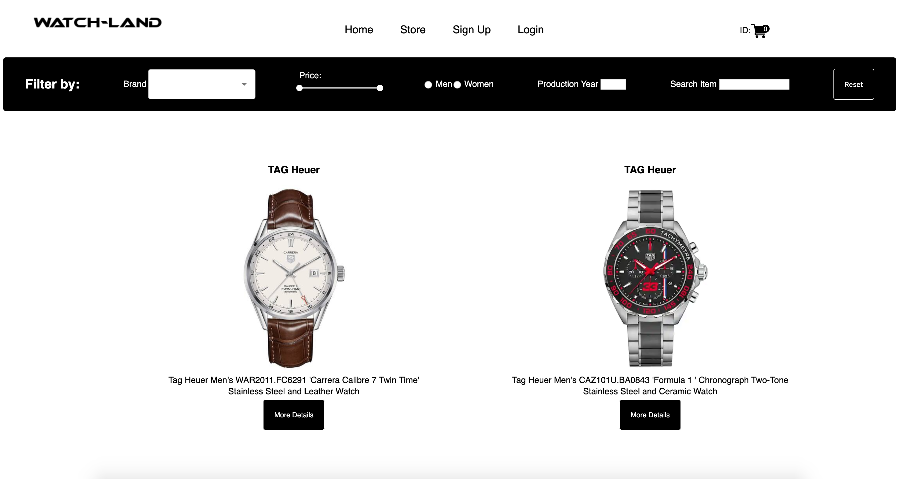
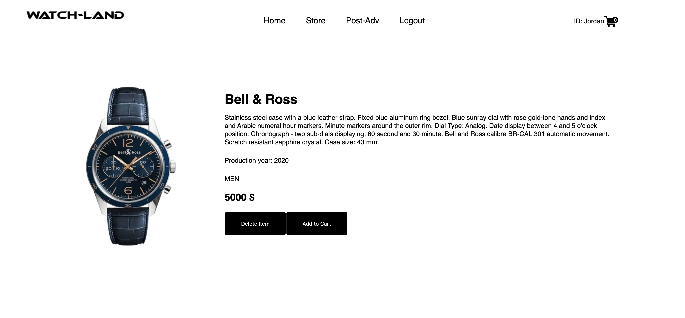

<h1> Watch Land </h1>
<h2> Concordia Full-Stack Web Development Bootcamp - First Project</h2>
<h3>Features: </h3>

 <ul>    
   <li> Provided to buy and sell watches online</li>
   <li> Powerful search and filter option</li>
   <li> Browse the items in gallery mode and providing item details page for every item.</li>  
 </ul>
   
<h3>Highlights: </h3>
 <ul>  
   <li> JavaScript</li>
   <li> React</li>
   <li> Class Components</li>
   <li> Redux</li>
   <li> JavaScript Extension (JSX) </li>
   <li> NodeJS </li>
   <li> Express </li>
   <li> MongoDB</li>
 </ul>
<h3>See live: </h3>   
   
https://watch-land.herokuapp.com/

<h3>Demo: </h3>
   
https://www.youtube.com/watch?v=Taha4IsQMH0

